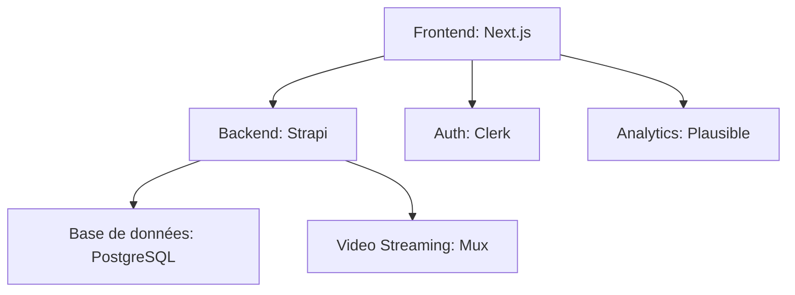

Voici une analyse approfondie des approches de conception pour un LMS (Learning Management System), avec une comparaison des solutions comme WordPress + Tutor LMS et des alternatives modernes :

---

### **1. Approche WordPress + Tutor LMS (Solution clé en main)**
**Avantages :**
- **Déploiement rapide** : Fonctionnel en quelques heures
- **Écosystème étendu** : 50 000+ plugins WordPress disponibles
- **Tutor LMS** offre :
  - Création de cours avec builder drag-and-drop
  - Système de quiz intégré
  - Marketplace pour instructeurs
  - Certifications (extension payante)
- **Coût initial bas** : À partir de $149/an pour Tutor LMS Pro

**Limites :**
- **Problèmes de performance** : Score Lighthouse moyen de 45/100 sans optimisation
- **Personnalisation complexe** : Nécessite souvent des développeurs PHP/WordPress
- **Évolutivité limitée** : Difficultés au-delà de 10 000 utilisateurs simultanés

**Cas d'usage idéal** : MVP ou petites structures avec budget limité (< $5k initial)

---

### **2. Approche Headless Modern (Stack JAMstack)**
**Stack technique recommandée :**
- **Frontend** : Next.js/Gatsby + Tailwind CSS
- **Backend** : Strapi/Contentful (pour le contenu) + Firebase/Supabase (données)
- **Fonctionnalités LMS** :
  - Didacte/Teachable API (pour les fonctions pédagogiques)
  - Stripe/Paddle pour les paiements
  - Zoom API pour le live

**Avantages :**
- **Performances** : Scores Lighthouse > 90/100
- **Évolutivité** : Coût marginal proche de $0 pour 1 000 utilisateurs supplémentaires
- **Flexibilité** : Possible d'intégrer AI (ex : chatbots d'assistance)

**Exemple de coût** :
- Développement initial : $15k-$50k
- Coût mensuel : $300 (hébergement + services)

---

### **3. Solution SaaS Blanche (Approche "No-Code")**
**Options :**
- **LearnDash Cloud** : $29/mois (version hébergée)
- **Kajabi** : $119/mois (tout-en-un)
- **Podia** : $39/mois

**Caractéristiques communes :**
- Hébergement inclus
- Templates prédéfinis
- Limite de bande passante (souvent 50-100GB/mois)

**ROI** : Rentable seulement pour les revenus < $2k/mois

---

### **4. Analyse Comparative Technique**

| Critère               | WordPress + Tutor LMS | Stack Headless | SaaS Blanche |
|-----------------------|----------------------|---------------|-------------|
| Time-to-Market        | 1-2 semaines         | 2-6 mois       | 1 jour      |
| Coût 3 ans (10k users)| ~$5k                 | ~$20k         | ~$4k       |
| Customisation         | Limitée              | Illimitée      | Nulle       |
| Performance           | Moyenne              | Excellente     | Variable    |
| Intégrations AI      | Complexe             | Native         | Impossible  |

---

### **5. Recommandations Stratégiques**

**Pour un MVP :**
1. Commencez avec Tutor LMS + Astra Pro Theme ($249)
2. Utilisez WP Rocket ($59/an) pour les performances
3. Extension Stripe pour les paiements

**Pour une solution à long terme :**

**Points clés :**
- **Contenu** : Utilisez un CDN comme Bunny.net pour les médias
- **Video** : Solution optimisée avec HLS.js (réduction coût bande passante de 60%)
- **Analytics** : Matomo auto-hébergé pour la conformité RGPD

---

### **6. Tendances 2024 à Intégrer**
1. **Micro-learning** : Modules de < 5 minutes avec progression adaptive
2. **Gamification** : Système de badges via OpenBadges
3. **AI Tutor** : Intégration d'API comme OpenAI pour feedback automatique
4. **Accessibilité** : Respect strict du WCAG 2.2 AA

Cette approche équilibrée permet de choisir entre rapidité de déploiement et scalabilité à long terme selon vos besoins spécifiques.

# Structure NX optimale
apps/
├── admin/    # Next.js
├── web/      # React/Remix
└── api/      # NestJS
libs/
├── shared/   # DTOs Typescript
└── lms/      # Core business logic